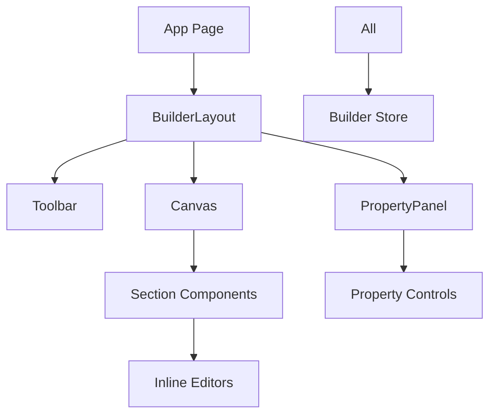

# Phase 1 Development Request - Core Section Implementation

## Document Information
- **Phase**: 1 - Core Builder Foundation
- established.js, TypeScript, Tailwind CSS
- **Expected Duration**: 2 weeks
- **Priority**: Critical - Foundation for all features

---

## Executive Summary

Phase 1 focuses on implementing the three core sections (Hero, Content, CTA) with basic editing capabilities. This phase establishes the foundation for the entire builder, including the layout structure, state management, and basic interactivity.

## Scope of Work

### 1. Project Setup & Configuration

#### Required Setup Tasks
```bash
# 1. Initialize Next.js project with TypeScript
npx create-next-app@latest landing-builder --typescript --tailwind --app

# 2. Install required dependencies
npm install zustand @dnd-kit/sortable @dnd-kit/core uuid
npm install react-colorful react-icons
npm install --save-dev @types/uuid
```

#### Project Configuration Files

**tsconfig.json** - Add path aliases:
```json
{
  "compilerOptions": {
    "paths": {
      "@/components/*": ["./src/components/*"],
      "@/lib/*": ["./src/lib/*"],
      "@/store/*": ["./src/store/*"],
      "@/types/*": ["./src/types/*"],
      "@/styles/*": ["./src/styles/*"]
    }
  }
}
```

**tailwind.config.ts** - Custom configuration:
```typescript
export default {
  content: ['./src/**/*.{js,ts,jsx,tsx,mdx}'],
  theme: {
    extend: {
      colors: {
        'builder-border': '#e5e7eb',
        'builder-bg': '#f9fafb',
        'builder-selected': '#3b82f6'
      }
    }
  }
}
```

### 2. Type Definitions

Create `/src/types/builder.types.ts`:

```typescript
// Section Types
export type SectionType = 'hero' | 'content' | 'cta';

export interface BaseSection {
  id: string;
  type: SectionType;
  order: number;
}

export interface HeroSection extends BaseSection {
  type: 'hero';
  data: {
    headline: string;
    subheadline: string;
    buttonText: string;
    buttonAction: 'scroll' | 'form' | 'link';
    backgroundType: 'color' | 'image' | 'gradient';
    backgroundColor: string;
    backgroundImage?: string;
    backgroundGradient?: string;
    textColor: string;
    buttonColor: string;
    alignment: 'left' | 'center' | 'right';
  };
}

export interface ContentSection extends BaseSection {
  type: 'content';
  data: {
    title: string;
    content: string;
    imageUrl?: string;
    imagePosition: 'left' | 'right' | 'top' | 'bottom';
    backgroundColor: string;
    textColor: string;
    padding: 'small' | 'medium' | 'large';
  };
}

export interface CTASection extends BaseSection {
  type: 'cta';
  data: {
    title: string;
    description: string;
    formEnabled: boolean;
    formFields: {
      name: boolean;
      email: boolean;
      phone: boolean;
    };
    buttonText: string;
    recipientEmail: string;
    backgroundColor: string;
    textColor: string;
    buttonColor: string;
  };
}

export type Section = HeroSection | ContentSection | CTASection;

// Page State
export interface PageState {
  id: string;
  title: string;
  sections: Section[];
  globalStyles: {
    primaryColor: string;
    secondaryColor: string;
    fontFamily: 'modern' | 'classic' | 'playful';
  };
  metadata: {
    description: string;
    favicon?: string;
  };
}

// Builder State
export interface BuilderState {
  page: PageState;
  selectedSectionId: string | null;
  isPreviewMode: boolean;
  isDragging: boolean;
  hasUnsavedChanges: boolean;
}
```

### 3. State Management Implementation

Create `/src/store/builderStore.ts`:

```typescript
import { create } from 'zustand';
import { Section, PageState, BuilderState } from '@/types/builder.types';
import { v4 as uuidv4 } from 'uuid';

interface BuilderStore extends BuilderState {
  // Actions
  initializePage: () => void;
  updateSection: (sectionId: string, updates: Partial<Section['data']>) => void;
  reorderSections: (newOrder: string[]) => void;
  selectSection: (sectionId: string | null) => void;
  togglePreview: () => void;
  updateGlobalStyles: (styles: Partial<PageState['globalStyles']>) => void;
  updateMetadata: (metadata: Partial<PageState['metadata']>) => void;
  saveToLocalStorage: () => void;
  loadFromLocalStorage: () => void;
}

const defaultSections: Section[] = [
  {
    id: uuidv4(),
    type: 'hero',
    order: 0,
    data: {
      headline: 'Welcome to Your Landing Page',
      subheadline: 'Create beautiful pages in minutes',
      buttonText: 'Get Started',
      buttonAction: 'scroll',
      backgroundType: 'gradient',
      backgroundColor: '#3b82f6',
      backgroundGradient: 'linear-gradient(135deg, #667eea 0%, #764ba2 100%)',
      textColor: '#ffffff',
      buttonColor: '#10b981',
      alignment: 'center'
    }
  },
  {
    id: uuidv4(),
    type: 'content',
    order: 1,
    data: {
      title: 'Features That Matter',
      content: 'Build responsive, professional landing pages without any coding knowledge.',
      imagePosition: 'right',
      backgroundColor: '#ffffff',
      textColor: '#1f2937',
      padding: 'medium'
    }
  },
  {
    id: uuidv4(),
    type: 'cta',
    order: 2,
    data: {
      title: 'Ready to Get Started?',
      description: 'Join thousands of satisfied customers',
      formEnabled: true,
      formFields: {
        name: true,
        email: true,
        phone: true
      },
      buttonText: 'Submit',
      recipientEmail: '',
      backgroundColor: '#f3f4f6',
      textColor: '#1f2937',
      buttonColor: '#3b82f6'
    }
  }
];

export const useBuilderStore = create<BuilderStore>((set, get) => ({
  // Initial state
  page: {
    id: uuidv4(),
    title: 'Untitled Page',
    sections: defaultSections,
    globalStyles: {
      primaryColor: '#3b82f6',
      secondaryColor: '#10b981',
      fontFamily: 'modern'
    },
    metadata: {
      description: ''
    }
  },
  selectedSectionId: null,
  isPreviewMode: false,
  isDragging: false,
  hasUnsavedChanges: false,

  // Actions implementation
  initializePage: () => {
    // Load from localStorage or use defaults
    const saved = localStorage.getItem('builder-draft');
    if (saved) {
      const parsed = JSON.parse(saved);
      set({ page: parsed });
    }
  },

  updateSection: (sectionId, updates) => {
    set((state) => ({
      page: {
        ...state.page,
        sections: state.page.sections.map((section) =>
          section.id === sectionId
            ? { ...section, data: { ...section.data, ...updates } }
            : section
        )
      },
      hasUnsavedChanges: true
    }));
  },

  reorderSections: (newOrder) => {
    // Implementation for drag-and-drop reordering
  },

  selectSection: (sectionId) => {
    set({ selectedSectionId: sectionId });
  },

  togglePreview: () => {
    set((state) => ({ isPreviewMode: !state.isPreviewMode }));
  },

  updateGlobalStyles: (styles) => {
    set((state) => ({
      page: {
        ...state.page,
        globalStyles: { ...state.page.globalStyles, ...styles }
      },
      hasUnsavedChanges: true
    }));
  },

  updateMetadata: (metadata) => {
    set((state) => ({
      page: {
        ...state.page,
        metadata: { ...state.page.metadata, ...metadata }
      },
      hasUnsavedChanges: true
    }));
  },

  saveToLocalStorage: () => {
    const state = get();
    localStorage.setItem('builder-draft', JSON.stringify(state.page));
    set({ hasUnsavedChanges: false });
  },

  loadFromLocalStorage: () => {
    const saved = localStorage.getItem('builder-draft');
    if (saved) {
      set({ page: JSON.parse(saved) });
    }
  }
}));
```

### 4. Component Development

#### 4.1 Layout Structure

Create `/src/components/builder/BuilderLayout.tsx`:

```typescript
interface BuilderLayoutProps {
  children: React.ReactNode;
  leftPanel: React.ReactNode;
  rightPanel: React.ReactNode;
  toolbar: React.ReactNode;
}

export default function BuilderLayout({
  children,
  leftPanel,
  rightPanel,
  toolbar
}: BuilderLayoutProps) {
  return (
    <div className="h-screen flex flex-col bg-builder-bg">
      {/* Toolbar */}
      <div className="h-14 border-b border-builder-border bg-white">
        {toolbar}
      </div>
      
      {/* Main Content */}
      <div className="flex-1 flex overflow-hidden">
        {/* Left Panel */}
        <div className="w-64 border-r border-builder-border bg-white overflow-y-auto">
          {leftPanel}
        </div>
        
        {/* Center Canvas */}
        <div className="flex-1 overflow-y-auto bg-gray-50">
          {children}
        </div>
        
        {/* Right Panel */}
        <div className="w-80 border-l border-builder-border bg-white overflow-y-auto">
          {rightPanel}
        </div>
      </div>
    </div>
  );
}
```

#### 4.2 Section Components

**Hero Section** - `/src/components/sections/HeroSection.tsx`:
```typescript
Requirements:
- Editable headline and subheadline (inline editing)
- Background options (color/gradient/image)
- CTA button with customizable text
- Text alignment options
- Responsive design
- Hover states for editing
```

**Content Section** - `/src/components/sections/ContentSection.tsx`:
```typescript
Requirements:
- Title and content text editing
- Optional image with position variants
- Padding controls
- Background color
- Image upload placeholder (Phase 2)
```

**CTA Section** - `/src/components/sections/CTASection.tsx`:
```typescript
Requirements:
- Title and description
- Form fields toggle (name/email/phone)
- Submit button customization
- Email recipient setting
- Form validation UI (no backend yet)
```

#### 4.3 Editing Components

**Inline Text Editor** - `/src/components/editor/InlineTextEditor.tsx`:
```typescript
interface InlineTextEditorProps {
  value: string;
  onChange: (value: string) => void;
  className?: string;
  placeholder?: string;
  multiline?: boolean;
}
```

**Color Picker** - `/src/components/editor/ColorPicker.tsx`:
```typescript
interface ColorPickerProps {
  color: string;
  onChange: (color: string) => void;
  label: string;
  presets?: string[];
}
```

### 5. Canvas Implementation

Create `/src/components/builder/Canvas.tsx`:

```typescript
Features Required:
1. Render all three sections
2. Section selection on click
3. Visual feedback for selected section
4. Hover states
5. Drag-and-drop placeholder (visual only in Phase 1)
6. Responsive preview container
```

### 6. Property Panel Implementation

Create `/src/components/builder/PropertyPanel.tsx`:

```typescript
Requirements:
1. Context-sensitive controls based on selected section
2. Grouped properties (Text, Background, Layout, etc.)
3. Real-time updates to canvas
4. Accordion-style property groups
5. Reset to default option
```

### 7. Toolbar Implementation

Create `/src/components/builder/Toolbar.tsx`:

```typescript
Required Actions:
1. Save Draft (localStorage)
2. Preview (Desktop view only in Phase 1)
3. Undo/Redo placeholders
4. View toggle (Edit/Preview)
5. Settings modal placeholder
```

## Module Structure

### Core Modules

```
/src
├── /components
│   ├── /builder           # Builder-specific components
│   │   ├── BuilderLayout.tsx
│   │   ├── Canvas.tsx
│   │   ├── PropertyPanel.tsx
│   │   ├── Toolbar.tsx
│   │   └── SectionWrapper.tsx
│   ├── /sections          # Section components
│   │   ├── HeroSection.tsx
│   │   ├── ContentSection.tsx
│   │   └── CTASection.tsx
│   ├── /editor           # Editing tools
│   │   ├── InlineTextEditor.tsx
│   │   ├── ColorPicker.tsx
│   │   └── AlignmentSelector.tsx
│   └── /ui               # Reusable UI components
│       ├── Button.tsx
│       ├── Input.tsx
│       └── Select.tsx
├── /store
│   └── builderStore.ts
├── /lib
│   ├── utils.ts          # Helper functions
│   └── constants.ts      # App constants
├── /hooks
│   ├── useAutoSave.ts
│   └── useKeyboardShortcuts.ts
└── /types
    └── builder.types.ts
```

### Module Dependencies



## Testing Requirements

### Unit Tests

```typescript
// Test files to create:
__tests__/
├── /components
│   ├── HeroSection.test.tsx
│   ├── ContentSection.test.tsx
│   └── CTASection.test.tsx
├── /store
│   └── builderStore.test.ts
└── /lib
    └── utils.test.ts
```

### Manual Testing Checklist

#### Section Functionality
- [ ] Hero section renders with default content
- [ ] Content section renders with default content
- [ ] CTA section renders with form fields
- [ ] All text fields are editable
- [ ] Color pickers update section colors
- [ ] Section selection works correctly
- [ ] Selected section shows visual indicator

#### State Management
- [ ] Changes persist in store
- [ ] localStorage save/load works
- [ ] Unsaved changes indicator appears
- [ ] State updates don't cause unnecessary re-renders

#### UI/UX
- [ ] Layout is responsive at 1024px+ width
- [ ] All interactive elements have hover states
- [ ] Keyboard navigation works (Tab)
- [ ] No console errors during interaction
- [ ] Loading states appear appropriately

#### Cross-browser Testing
- [ ] Chrome (latest)
- [ ] Firefox (latest)
- [ ] Safari (latest)
- [ ] Edge (latest)

## Acceptance Criteria

### Functional Requirements

1. **Section Rendering**
   - All 3 sections display with default content
   - Sections maintain fixed order (Hero → Content → CTA)
   - Each section has unique styling

2. **Text Editing**
   - Click on any text to edit inline
   - Changes reflect immediately
   - Escape key cancels editing
   - Enter/clicking outside saves changes

3. **Property Panel**
   - Shows properties for selected section
   - All property changes update canvas in real-time
   - Color pickers work with hex values

4. **State Persistence**
   - Auto-save to localStorage every 10 seconds
   - Manual save button works
   - Reload page maintains state

5. **Visual Feedback**
   - Selected section has blue border
   - Hover states on all interactive elements
   - Disabled states for unavailable actions

### Performance Requirements

- Initial load: < 2 seconds
- Section selection: < 50ms response
- Property updates: < 100ms reflection
- Auto-save: Non-blocking
- Memory usage: < 100MB

### Code Quality Requirements

- TypeScript: No `any` types
- ESLint: Zero errors
- Prettier: All files formatted
- Comments: Complex logic documented
- Component size: < 200 lines per file

## Deliverables

### Required Files

1. **Components** (14 files)
   - BuilderLayout.tsx
   - Canvas.tsx
   - PropertyPanel.tsx
   - Toolbar.tsx
   - SectionWrapper.tsx
   - HeroSection.tsx
   - ContentSection.tsx
   - CTASection.tsx
   - InlineTextEditor.tsx
   - ColorPicker.tsx
   - AlignmentSelector.tsx
   - Button.tsx
   - Input.tsx
   - Select.tsx

2. **Store** (1 file)
   - builderStore.ts

3. **Types** (1 file)
   - builder.types.ts

4. **Pages** (1 file)
   - app/builder/page.tsx

5. **Utilities** (2 files)
   - lib/utils.ts
   - lib/constants.ts

### Documentation

1. **README.md** - Setup and run instructions
2. **COMPONENTS.md** - Component API documentation
3. **STATE.md** - State management guide

## Development Guidelines

### Coding Standards

```typescript
// Component template
interface ComponentProps {
  // Props with JSDoc comments
}

export default function ComponentName({ prop1, prop2 }: ComponentProps) {
  // Hooks at the top
  // Event handlers
  // Render logic
  return <div>{/* JSX */}</div>;
}
```

### Git Commit Convention

```bash
feat: Add hero section component
fix: Resolve color picker update issue
refactor: Simplify property panel logic
docs: Update component documentation
test: Add unit tests for sections
```

### Branch Strategy

```bash
main
├── develop
│   ├── feature/hero-section
│   ├── feature/content-section
│   ├── feature/cta-section
│   └── feature/property-panel
```

## Risk Mitigation

### Identified Risks

1. **State Management Complexity**
   - Mitigation: Start simple, add complexity gradually
   
2. **Browser Compatibility**
   - Mitigation: Test early and often
   
3. **Performance with Large Content**
   - Mitigation: Implement virtualization if needed
   
4. **Inline Editing UX**
   - Mitigation: Research and test multiple approaches

## Questions & Clarifications

Before starting development, please confirm:

1. Should sections be deletable or are they always fixed?
2. Do we need mobile preview in Phase 1?
3. Should we implement keyboard shortcuts?
4. What's the maximum text length for fields?
5. Do we need form validation in Phase 1?

---

*This document serves as the complete specification for Phase 1 development. Any changes must be documented and approved before implementation.*