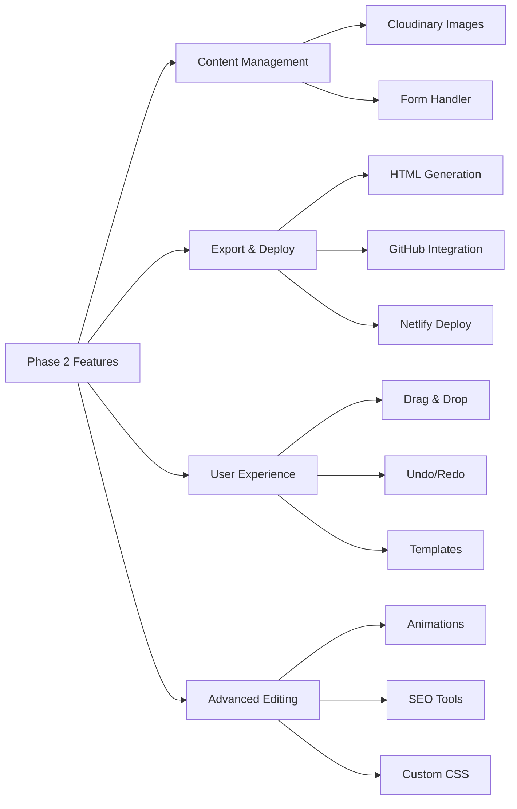

# Phase 2 Development Request - Advanced Features & Deployment

## Document Information
- **Phase**: 2 - Advanced Features & Production Deployment
- **Stack**: Next.js 14, TypeScript, Tailwind CSS, Cloudinary, GitHub API, Netlify
- **Expected Duration**: 3 weeks
- **Prerequisites**: Phase 1 completed and tested
- **Priority**: High - Core functionality for production release

---

## Executive Summary

Phase 2 transforms the basic builder into a production-ready platform with image management, HTML generation, one-click deployment to Netlify, and enhanced user experience features. This phase enables users to create, customize, and publish real landing pages to the web.

## Scope of Work

### Overview of Features



## 1. Image Management System (Cloudinary Integration)

### 1.1 Setup Requirements

```bash
# Install dependencies
npm install cloudinary react-dropzone axios
npm install --save-dev @types/react-dropzone

# Environment variables (.env.local)
NEXT_PUBLIC_CLOUDINARY_CLOUD_NAME=your_cloud_name
NEXT_PUBLIC_CLOUDINARY_UPLOAD_PRESET=your_preset
CLOUDINARY_API_SECRET=your_api_secret
```

### 1.2 Implementation Tasks

#### Create `/src/lib/cloudinary.ts`:

```typescript
interface CloudinaryUploadResponse {
  secure_url: string;
  public_id: string;
  width: number;
  height: number;
  format: string;
  bytes: number;
  created_at: string;
  thumbnail_url: string;
}

interface CloudinaryConfig {
  cloudName: string;
  uploadPreset: string;
  folder: string;
  transformations?: {
    quality: string;
    fetch_format: string;
  };
}

export class CloudinaryService {
  private config: CloudinaryConfig;

  constructor() {
    this.config = {
      cloudName: process.env.NEXT_PUBLIC_CLOUDINARY_CLOUD_NAME!,
      uploadPreset: process.env.NEXT_PUBLIC_CLOUDINARY_UPLOAD_PRESET!,
      folder: 'landing-pages',
      transformations: {
        quality: 'auto',
        fetch_format: 'auto'
      }
    };
  }

  async uploadImage(file: File): Promise<CloudinaryUploadResponse> {
    // Validate file
    if (!this.validateFile(file)) {
      throw new Error('Invalid file type or size');
    }

    // Create form data
    const formData = new FormData();
    formData.append('file', file);
    formData.append('upload_preset', this.config.uploadPreset);
    formData.append('folder', this.config.folder);

    // Upload to Cloudinary
    const response = await fetch(
      `https://api.cloudinary.com/v1_1/${this.config.cloudName}/image/upload`,
      {
        method: 'POST',
        body: formData
      }
    );

    return response.json();
  }

  validateFile(file: File): boolean {
    const validTypes = ['image/jpeg', 'image/png', 'image/webp', 'image/gif'];
    const maxSize = 5 * 1024 * 1024; // 5MB
    
    return validTypes.includes(file.type) && file.size <= maxSize;
  }

  getOptimizedUrl(url: string, width?: number): string {
    // Return Cloudinary transformation URL
    if (width) {
      return url.replace('/upload/', `/upload/w_${width},q_auto,f_auto/`);
    }
    return url.replace('/upload/', '/upload/q_auto,f_auto/');
  }
}
```

#### Create `/src/components/editor/ImageUploader.tsx`:

```typescript
interface ImageUploaderProps {
  onUpload: (url: string) => void;
  currentImage?: string;
  aspectRatio?: '16:9' | '4:3' | '1:1' | 'free';
}

Features Required:
1. Drag & drop zone with visual feedback
2. Click to browse files
3. Upload progress indicator
4. Image preview after upload
5. Replace image functionality
6. Delete image option
7. Error handling with user feedback
8. Automatic optimization settings
```

### 1.3 Integration Points

- Update HeroSection to support background images
- Update ContentSection to support inline images
- Add image gallery component for future use
- Store image URLs in section data
- Implement lazy loading for performance

## 2. HTML Generation System

### 2.1 HTML Generator Architecture

#### Create `/src/lib/html-generator.ts`:

```typescript
interface GeneratorOptions {
  minify: boolean;
  inlineCSS: boolean;
  includeAnalytics: boolean;
  includeMeta: boolean;
}

interface GeneratedHTML {
  html: string;
  css: string;
  js: string;
  size: number;
  warnings: string[];
}

export class HTMLGenerator {
  generateHTML(page: PageState, options: GeneratorOptions): GeneratedHTML {
    // Implementation requirements
  }

  private generateCSS(page: PageState): string {
    // Generate optimized CSS
  }

  private generateMeta(metadata: PageMetadata): string {
    // Generate SEO meta tags
  }

  private generateSections(sections: Section[]): string {
    // Convert sections to HTML
  }

  private minifyHTML(html: string): string {
    // Minification logic
  }

  private validateHTML(html: string): string[] {
    // Return any warnings
  }
}
```

### 2.2 Template System

#### Create `/src/templates/`:

```
templates/
├── base.html           # Base HTML structure
├── sections/
│   ├── hero.html      # Hero section template
│   ├── content.html   # Content section template
│   └── cta.html       # CTA section template
├── styles/
│   ├── reset.css      # CSS reset
│   ├── utilities.css  # Utility classes
│   └── responsive.css # Responsive rules
└── scripts/
    ├── form.js        # Form handler
    └── analytics.js   # Analytics snippet
```

### 2.3 Form Handler Implementation

#### Create `/src/lib/form-handler.ts`:

```typescript
interface FormConfig {
  recipientEmail: string;
  emailService: 'formspree' | 'netlify-forms' | 'custom';
  fields: FormField[];
  successMessage: string;
  errorMessage: string;
}

export function generateFormHandler(config: FormConfig): string {
  // Generate appropriate form handling JavaScript
}
```

## 3. Deployment System (GitHub + Netlify)

### 3.1 GitHub Integration

#### Create `/src/lib/github-service.ts`:

```typescript
import { Octokit } from '@octokit/rest';

interface DeploymentConfig {
  owner: string;
  repo: string;
  branch: string;
  token: string;
}

interface DeploymentResult {
  success: boolean;
  url?: string;
  commitSha?: string;
  error?: string;
}

export class GitHubService {
  private octokit: Octokit;
  private config: DeploymentConfig;

  constructor(config: DeploymentConfig) {
    this.octokit = new Octokit({
      auth: config.token
    });
    this.config = config;
  }

  async deployPage(
    userId: string,
    pageId: string,
    html: string
  ): Promise<DeploymentResult> {
    try {
      // Check if file exists
      const path = `sites/${userId}/${pageId}/index.html`;
      let sha: string | undefined;

      try {
        const existing = await this.octokit.repos.getContent({
          owner: this.config.owner,
          repo: this.config.repo,
          path
        });
        sha = Array.isArray(existing.data) ? undefined : existing.data.sha;
      } catch (e) {
        // File doesn't exist, will create new
      }

      // Create or update file
      const response = await this.octokit.repos.createOrUpdateFileContents({
        owner: this.config.owner,
        repo: this.config.repo,
        path,
        message: `Deploy page ${pageId} for user ${userId}`,
        content: Buffer.from(html).toString('base64'),
        sha
      });

      return {
        success: true,
        commitSha: response.data.commit.sha,
        url: `https://${this.config.owner}.github.io/${this.config.repo}/${userId}/${pageId}`
      };
    } catch (error) {
      return {
        success: false,
        error: error.message
      };
    }
  }
}
```

### 3.2 Netlify Configuration

#### Create `/src/lib/netlify-service.ts`:

```typescript
interface NetlifyDeployment {
  id: string;
  url: string;
  status: 'pending' | 'ready' | 'error';
  ssl_url: string;
  created_at: string;
}

export class NetlifyService {
  async waitForDeployment(siteId: string): Promise<NetlifyDeployment> {
    // Poll Netlify API for deployment status
  }

  async getSiteUrl(siteId: string): Promise<string> {
    // Get the public URL for the deployed site
  }
}
```

### 3.3 Deployment API Endpoint

#### Create `/src/app/api/deploy/route.ts`:

```typescript
export async function POST(request: Request) {
  // 1. Authenticate user
  // 2. Generate HTML from page state
  // 3. Push to GitHub
  // 4. Wait for Netlify deployment
  // 5. Return deployed URL
}
```

## 4. Drag & Drop System

### 4.1 Installation

```bash
npm install @dnd-kit/core @dnd-kit/sortable @dnd-kit/utilities
```

### 4.2 Implementation

#### Update `/src/components/builder/Canvas.tsx`:

```typescript
import {
  DndContext,
  closestCenter,
  KeyboardSensor,
  PointerSensor,
  useSensor,
  useSensors,
} from '@dnd-kit/core';
import {
  arrayMove,
  SortableContext,
  sortableKeyboardCoordinates,
  verticalListSortingStrategy,
} from '@dnd-kit/sortable';

Features to implement:
1. Draggable section handles
2. Drop zones with visual feedback
3. Smooth animations during drag
4. Keyboard support for accessibility
5. Mobile touch support
6. Auto-scroll when dragging near edges
```

## 5. Undo/Redo System

### 5.1 History Management

#### Create `/src/lib/history-manager.ts`:

```typescript
interface HistoryState<T> {
  past: T[];
  present: T;
  future: T[];
}

export class HistoryManager<T> {
  private maxHistorySize: number = 50;
  private state: HistoryState<T>;

  constructor(initialState: T) {
    this.state = {
      past: [],
      present: initialState,
      future: []
    };
  }

  push(newState: T): void {
    // Add to history
  }

  undo(): T | null {
    // Return previous state
  }

  redo(): T | null {
    // Return next state
  }

  canUndo(): boolean {
    return this.state.past.length > 0;
  }

  canRedo(): boolean {
    return this.state.future.length > 0;
  }
}
```

### 5.2 Store Integration

Update Zustand store to include history:
- Track state changes
- Implement undo/redo actions
- Add keyboard shortcuts (Ctrl+Z, Ctrl+Y)

## 6. Template System

### 6.1 Template Library

#### Create `/src/data/templates.ts`:

```typescript
export interface Template {
  id: string;
  name: string;
  category: 'business' | 'portfolio' | 'event' | 'product' | 'service';
  thumbnail: string;
  description: string;
  sections: Section[];
  colors: {
    primary: string;
    secondary: string;
  };
  font: string;
}

export const templates: Template[] = [
  {
    id: 'startup-landing',
    name: 'Startup Landing',
    category: 'business',
    // ... template data
  },
  {
    id: 'product-launch',
    name: 'Product Launch',
    category: 'product',
    // ... template data
  },
  // ... more templates
];
```

### 6.2 Template Selector Component

#### Create `/src/components/builder/TemplateSelector.tsx`:

```typescript
Features:
1. Grid view of templates
2. Category filtering
3. Search functionality
4. Preview on hover
5. One-click apply
6. Customization after selection
```

## 7. SEO Optimization Tools

### 7.1 Meta Tags Manager

#### Create `/src/components/seo/MetaTagsEditor.tsx`:

```typescript
interface MetaTags {
  title: string;
  description: string;
  keywords: string[];
  ogImage: string;
  ogTitle: string;
  ogDescription: string;
  twitterCard: 'summary' | 'summary_large_image';
  favicon: string;
}

Features:
1. Character count for title/description
2. Preview how it appears in Google
3. Social media preview
4. Favicon uploader
5. Schema.org structured data
```

## 8. Form Submission Handler

### 8.1 Email Service Integration

#### Create `/src/app/api/submit-form/route.ts`:

```typescript
interface FormSubmission {
  pageId: string;
  formData: Record<string, string>;
  recipientEmail: string;
  timestamp: string;
}

export async function POST(request: Request) {
  // 1. Validate form data
  // 2. Send email via service (SendGrid/Resend)
  // 3. Store submission (optional)
  // 4. Return success response
}
```

## 9. Animation System

### 9.1 Animation Presets

#### Create `/src/lib/animations.ts`:

```typescript
export interface AnimationPreset {
  name: string;
  type: 'entrance' | 'scroll' | 'hover';
  css: string;
  js?: string;
  preview: string;
}

export const animationPresets: AnimationPreset[] = [
  {
    name: 'Fade In',
    type: 'entrance',
    css: '@keyframes fadeIn { from { opacity: 0; } to { opacity: 1; } }',
    // ...
  }
];
```

## Testing Requirements

### Integration Tests

```typescript
describe('Phase 2 Features', () => {
  describe('Image Upload', () => {
    it('uploads image to Cloudinary');
    it('handles upload errors gracefully');
    it('validates file size and type');
  });

  describe('HTML Generation', () => {
    it('generates valid HTML');
    it('includes all sections');
    it('inlines CSS correctly');
    it('minifies output');
  });

  describe('Deployment', () => {
    it('pushes to GitHub successfully');
    it('handles GitHub API errors');
    it('returns correct Netlify URL');
  });

  describe('Drag & Drop', () => {
    it('reorders sections correctly');
    it('maintains state after reorder');
    it('handles edge cases');
  });

  describe('Undo/Redo', () => {
    it('tracks history correctly');
    it('undoes last action');
    it('redoes undone action');
    it('limits history size');
  });
});
```

### E2E Test Scenarios

1. **Complete Publishing Flow**
   - Create page → Add content → Upload images → Generate HTML → Deploy → Verify live URL

2. **Template Application**
   - Select template → Customize → Save → Export

3. **Form Submission**
   - Create form → Deploy → Submit test → Verify email received

## Performance Requirements

### Metrics

| Feature | Target | Maximum |
|---------|--------|---------|
| Image upload | < 3s | 10s |
| HTML generation | < 1s | 3s |
| GitHub push | < 2s | 5s |
| Netlify deploy | < 30s | 60s |
| Drag & drop | 60 fps | 30 fps |
| Undo/Redo | < 50ms | 100ms |

### Optimization Requirements

1. **Image Optimization**
   - Auto-compress before upload
   - Generate responsive variants
   - Lazy loading implementation
   - WebP format when possible

2. **HTML Output**
   - < 100KB total size
   - PageSpeed score > 90
   - Valid W3C HTML
   - Accessibility compliant

## Deliverables

### New Components (15 files)

1. **Image Management**
   - ImageUploader.tsx
   - ImageGallery.tsx
   - ImageOptimizer.tsx

2. **Deployment**
   - DeploymentModal.tsx
   - DeploymentStatus.tsx
   - PublishButton.tsx

3. **Templates**
   - TemplateSelector.tsx
   - TemplatePreview.tsx
   - TemplateCategorizer.tsx

4. **SEO Tools**
   - MetaTagsEditor.tsx
   - SEOPreview.tsx
   - SchemaGenerator.tsx

5. **Advanced Editing**
   - DraggableSection.tsx
   - AnimationSelector.tsx
   - CustomCSSEditor.tsx

### New Services (8 files)

1. cloudinary.ts
2. html-generator.ts
3. github-service.ts
4. netlify-service.ts
5. form-handler.ts
6. history-manager.ts
7. email-service.ts
8. analytics-tracker.ts

### API Endpoints (4 files)

1. /api/upload-image/route.ts
2. /api/generate-html/route.ts
3. /api/deploy/route.ts
4. /api/submit-form/route.ts

### Updated Components

1. Canvas.tsx (drag & drop)
2. Toolbar.tsx (undo/redo buttons)
3. HeroSection.tsx (image backgrounds)
4. ContentSection.tsx (image uploads)
5. builderStore.ts (history management)

## Development Timeline

###  1: Content Management
**1-1**: Cloudinary Integration
- Setup Cloudinary account and configuration
- Implement ImageUploader component
- Integrate with sections
- Test upload flow

**1-2* Handler
- Create form submission endpoint
- Email service integration
- Testing and validation

### 2: Export & Deploy
***2-1*ML Generation
- Template system setup
- CSS optimization
- JavaScript bundling
- Minification

**3*: GitHub Integration
- API setup
- File management
- Error handling

**3-1 Netlify Deployment
- Webhook configuration
- Deployment monitoring
- URL management

### 4 Enhanced UX
**Days 13-14**: Drag & Drop
- DnD Kit integration
- Animation polish
- Mobile support

**4-1 Undo/Redo
- History manager
- Keyboard shortcuts
- State persistence

**4-2 Templates
- Template library
- Selector UI
- Customization flow

**states**: Testing & Polish
- Integration testing
- Bug fixes
- Documentation
- Performance optimization

## Success Criteria

### Functional Requirements

✅ **Must Have**
- [ ] Images upload and display correctly
- [ ] HTML generates valid, optimized code
- [ ] Deploy to Netlify works reliably
- [ ] Form submissions send emails
- [ ] Drag & drop reorders sections
- [ ] Undo/redo works correctly
- [ ] Templates apply successfully

✅ **Should Have**
- [ ] SEO meta tags included
- [ ] Animation presets work
- [ ] Mobile drag & drop support
- [ ] Image optimization automatic

✅ **Nice to Have**
- [ ] Custom CSS injection
- [ ] A/B testing preparation
- [ ] Analytics integration
- [ ] Multi-language support

### Quality Metrics

| Metric | Target |
|--------|--------|
| Code Coverage | > 80% |
| Lighthouse Score | > 90 |
| Bundle Size | < 500KB |
| Time to Deploy | < 1 min |
| Error Rate | < 0.1% |

## Risk Mitigation

### Technical Risks

1. **Cloudinary Rate Limits**
   - Mitigation: Implement request throttling
   - Fallback: Local storage temporary cache

2. **GitHub API Limits**
   - Mitigation: Batch operations when possible
   - Fallback: Queue system for deployments

3. **HTML Generation Complexity**
   - Mitigation: Progressive enhancement
   - Fallback: Simplified templates

4. **Browser Compatibility**
   - Mitigation: Extensive testing
   - Fallback: Polyfills for older browsers

## Environment Variables

```env
# Cloudinary
NEXT_PUBLIC_CLOUDINARY_CLOUD_NAME=
NEXT_PUBLIC_CLOUDINARY_UPLOAD_PRESET=
CLOUDINARY_API_KEY=
CLOUDINARY_API_SECRET=

# GitHub
GITHUB_TOKEN=
GITHUB_OWNER=
GITHUB_REPO=

# Netlify
NETLIFY_SITE_ID=
NETLIFY_AUTH_TOKEN=

# Email Service (SendGrid/Resend)
EMAIL_API_KEY=
EMAIL_FROM_ADDRESS=
EMAIL_DOMAIN=

# Analytics (Optional)
NEXT_PUBLIC_GA_ID=
NEXT_PUBLIC_MIXPANEL_TOKEN=
```

## Documentation Requirements

### Developer Documentation
1. API reference for all new endpoints
2. Service class documentation
3. Component prop documentation
4. Deployment guide

### User Documentation
1. Image upload guide
2. Publishing workflow
3. Template customization
4. Form setup instructions

## Quality Assurance Checklist

### Pre-deployment Checklist

- [ ] All tests passing
- [ ] No TypeScript errors
- [ ] ESLint warnings resolved
- [ ] Performance benchmarks met
- [ ] Security review completed
- [ ] Documentation updated
- [ ] Environment variables set
- [ ] Backup system tested
- [ ] Error tracking configured
- [ ] Analytics verified

## Support & Escalation

### Phase 2 Specific Contacts

- **Cloudinary Support**: Technical integration questions
- **Netlify Support**: Deployment issues
- **GitHub API**: Rate limiting concerns
- **Email Service**: Delivery problems

## Acceptance Criteria

### Definition of Done

A feature is considered complete when:
1. Code is written and reviewed
2. Tests are written and passing
3. Documentation is updated
4. Feature works in all browsers
5. Performance targets are met
6. Security review passed
7. Product owner has approved

---

## Approval

**Prepared by**: Development Team Lead  
**Date**: [Current Date]  
**Version**: 2.0.0  
**Status**: Ready for Development

**Dependencies**: 
- Phase 1 must be complete and tested
- External service accounts must be created
- API keys must be obtained

**Sign-off Required**:
- [ ] Product Owner
- [ ] Technical Lead
- [ ] DevOps Lead
- [ ] Security Officer

---

*This document serves as the complete specification for Phase 2 development. Any scope changes must be documented and approved by all stakeholders.*